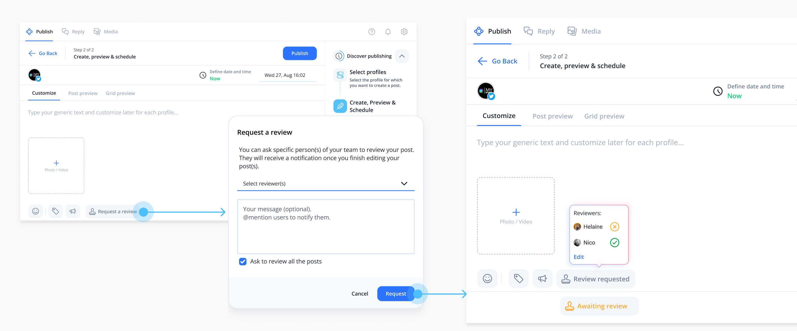

# Claude Guidelines — amandine-revol.github.io

These are instructions for Claude making changes to this portfolio site. Read this before editing files.

## About this project

Plain HTML/CSS/JS, no build tooling, hosted on GitHub Pages. No framework, no bundler, no component system — every page is a real, standalone `.html` file.

Key files:

- `index.html`, `about.html` — top-level pages
- `projects/*.html` — one file per case study (currently `note.html`, `instagram.html`)
- `style.scss` → compiles to `style.css` (with `style.css.map`)
- `menu.js`, `footer.js`, `lightbox.js` — small, single-purpose scripts
- `img/`, `projects/img/` — image assets
- FancyBox (jQuery plugin) is already loaded on project pages; `lightbox.js` wires it up

Because there's no templating, the header/nav and footer markup is duplicated across pages by hand. Keep that in mind: a lot of "code quality" problems here come from copy-paste drift between pages, not from complex logic.

## Code quality rules

1. **One concern per file, same as the existing scripts.** `menu.js` handles the menu, `footer.js` the footer, `lightbox.js` the lightbox. Don't bolt unrelated logic onto an existing script or write new inline `<script>` blocks — add a new small file if it's a new concern, and link it from the page.
2. **No inline styles and no inline `<script>` for anything non-trivial.** CSS lives in `style.scss`, JS lives in its own file. A one-line `onclick` is fine; a chunk of logic in the HTML is not.
3. **Edit `style.scss`, never hand-edit `style.css` directly.** `style.css` is compiled output (see `style.css.map`). Hand-editing it will be silently lost or cause drift between the two. If there's no compile step set up in this environment, say so explicitly instead of guessing at the compiled CSS.
4. **Keep shared markup (header, nav, footer) byte-identical across pages.** If you change the header/nav/footer on one page, apply the exact same change to every other page that has it (`index.html`, `about.html`, all of `projects/*.html`). Call out in your summary which files you touched so this doesn't get missed.
5. **Match the existing naming and indentation conventions** already used in the file you're editing rather than introducing a new style. Don't reformat whole files as a side effect of a small change — keep diffs focused and reviewable.
6. **No dead code.** Don't leave commented-out old versions, unused CSS classes, or console.log debugging statements behind after a change.
7. **Comment non-obvious sections briefly** (why, not what) — especially in CSS where a rule exists to fix a specific layout quirk.

## Accessibility requirements

- Follow WCAG 2.2 AA practices for every change: use sufficient color contrast (at least 4.5:1 for normal text and 3:1 for large text), preserve visible keyboard focus, and do not rely on color alone to communicate meaning.
- Use semantic HTML, correct heading order, descriptive image `alt` text, accessible link text, and labels for controls. Preserve keyboard access and sensible focus order for menus, dialogs, galleries, and interactive elements.
- Check responsive layouts at narrow and wide viewports, including text wrapping, touch target size, zoom, and horizontal overflow. Run an accessibility check when the change affects user-facing markup or interaction.

## Keep things short — avoid bloated files

- If a project page's HTML is growing very long, break it into clearly headed sections (Introduction, Research, Design, Final design, Conclusion — this is already the pattern in `note.html`) with a heading comment above each, rather than one long undifferentiated block.
- If you're about to repeat the same markup pattern (e.g. an image block, a metric callout) more than a couple of times on one page, that's a signal to standardize the markup for that pattern first, then reuse it consistently — not to write four slightly different variants.
- Don't add a new CSS framework, JS library, or dependency to solve something the existing small scripts could already do. This site works because it's simple; keep it that way.
- If `style.scss` is getting long, group related rules under a comment banner (e.g. `// ---- Project page: image grid ----`) instead of leaving rules scattered with no organization.

## Images on project detail pages — must use the lightbox

The site already loads FancyBox and has `lightbox.js` initializing it, but **the current project pages don't actually use it** — images are just wrapped in a plain `<a href="image.jpg">`, which today just navigates the browser to the raw image file instead of opening a nice zoomed view.

Whenever you add or touch an image on a project detail page, wrap it like this:

```
<a href="projects/img/note1.png" data-fancybox="note">
  
</a>
```

Rules:

- Always add `data-fancybox="<project-name>"` on the wrapping `<a>` — use the same group name for every image within one project page, so visitors can arrow through all of that case study's images instead of only seeing one.
- `href` should point at the full-resolution image; `src` can point at the same file unless a smaller thumbnail version exists.
- Always write a real `alt` text describing the screenshot's content, not the filename.
- Don't introduce a different lightbox/gallery library — this one is already wired up via `lightbox.js`, it just needs the attribute added on the markup side.
- As a first pass, also retrofit this onto the existing images on `note.html` and `instagram.html`, since they currently lack `data-fancybox` entirely.

## Writing style for case study copy

- Don't use em dashes in case study prose. Use a comma, period, or parentheses instead.

## Before you're done — verify

- Open every page you touched and click each image to confirm the lightbox opens (not a raw-image navigation).
- Check the browser console for JS errors on the pages you changed.
- Confirm the header/nav/footer still match across all pages if you touched shared markup.
- Check the page still looks correct on a narrow/mobile width, given the responsive viewport meta tag already in use.
